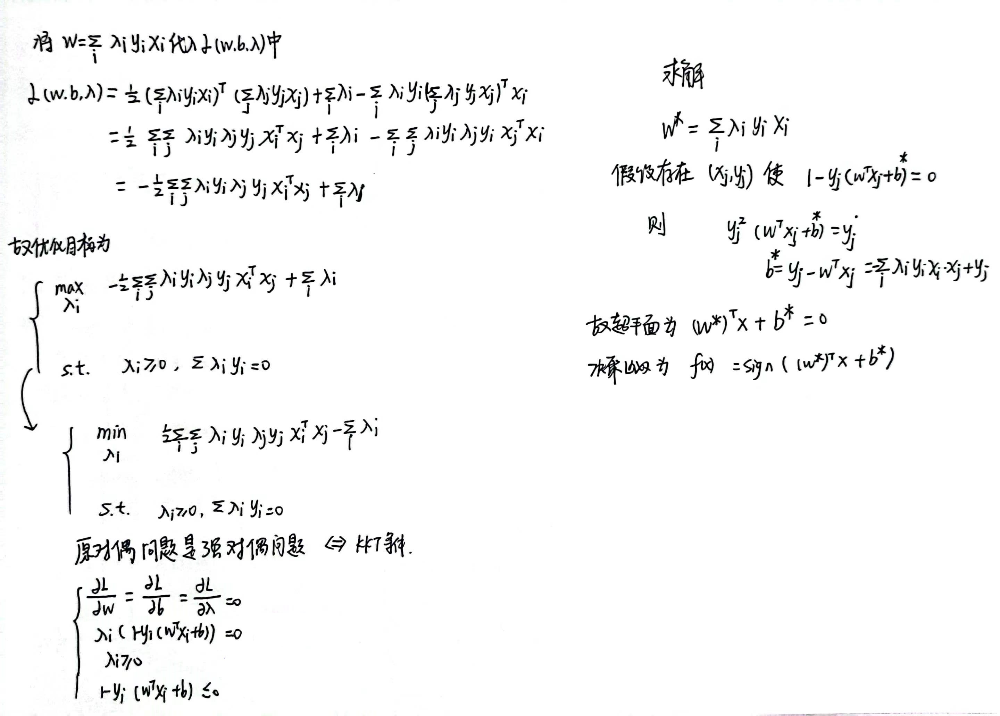
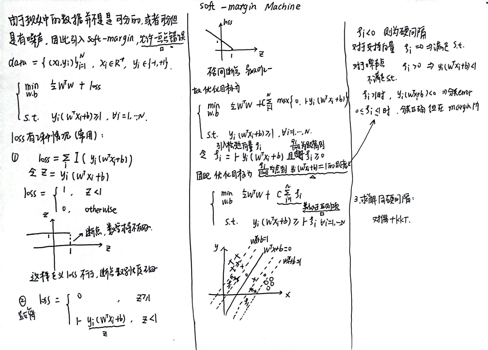
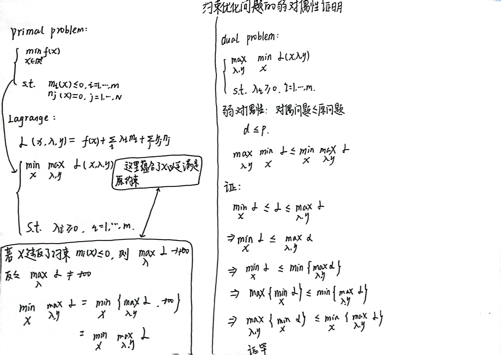
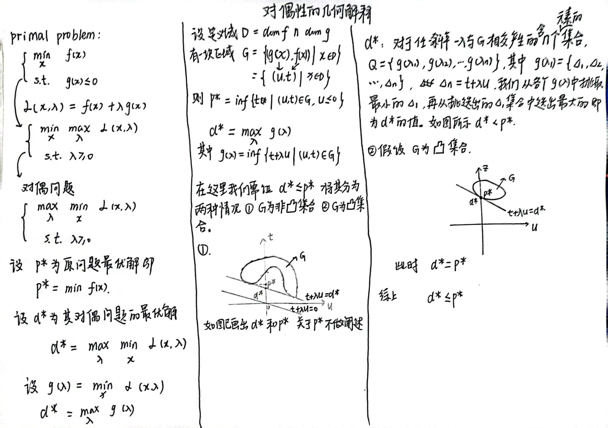
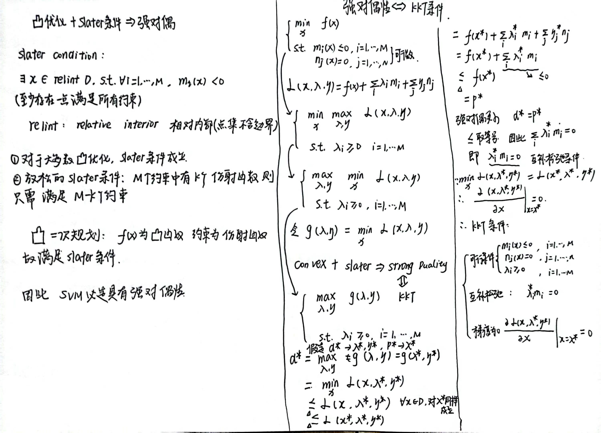

# SVM手推过程
以下均本人手推，引用说明出处。
## SVM
</img>  
## 求解Hard-margin SVM
</img>  
---
---
</img>  
## Soft-margin SVM
</img>  
## 约束优化问题的弱对偶性证明
</img>  
## 对偶性的几何解释  
</img>  
## slater条件、凸优化、强对偶、KKT
</img>  
