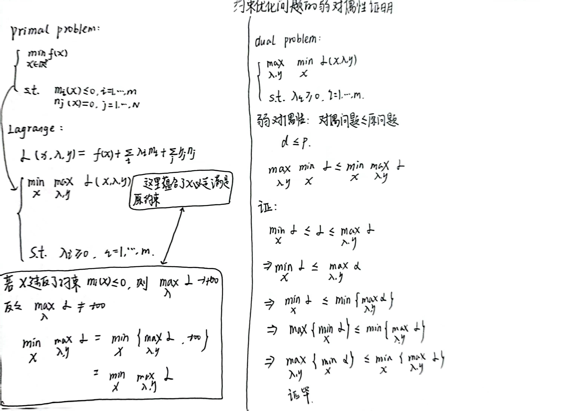

# SVM手推
以下均本人手推
## SVM
</img>  
## Hard-margin SVM
</img>  
---
---
</img> 
## SMO求解 λ
</img> 
---
---
</img> 
## Soft-margin SVM
</img> 
---
---
</img> 
## 约束优化问题的弱对偶性证明
</img> 
## 对偶性的几何解释  
</img>  
## slater条件、凸优化、强对偶、KKT
</img> 
## Kernel Method,Positive define kernel
</img> 
---
---
</img> 
## SVM回归
</img> 
---
---
</img> 
